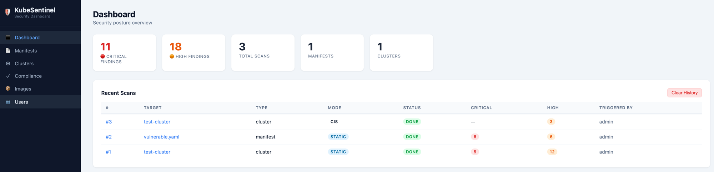
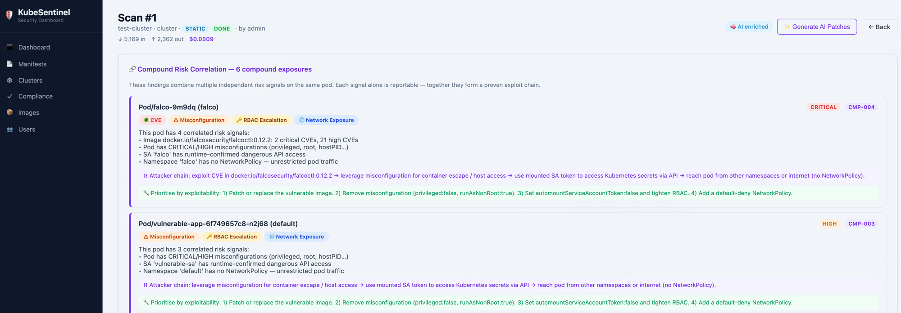
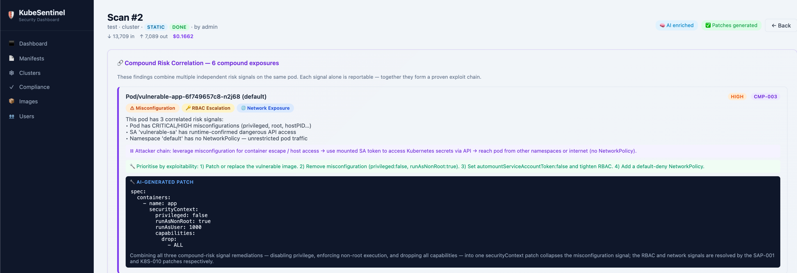
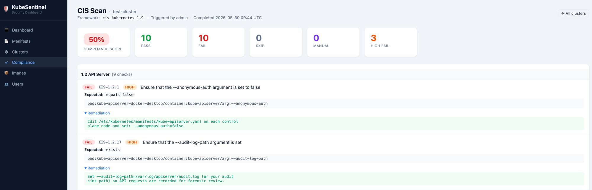
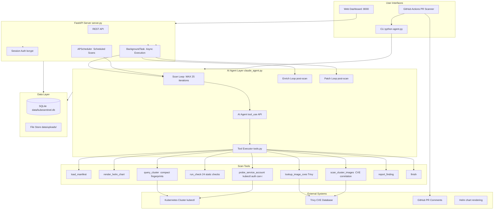

# KubeSentinel — AI-Powered Kubernetes Security Agent

> **Detect. Reason. Fix.** — An agentic Kubernetes security platform that reasons across CVE, misconfiguration, RBAC, and network signals to surface proven exploit chains, then enriches findings with AI-generated attack scenarios and YAML remediation patches on demand.

[](LICENSE)
[](https://www.python.org/)
[](https://www.anthropic.com/)
[](tests/)
[](https://hub.docker.com/r/jaydenaung17/kubesentinel)
[](https://hub.docker.com/r/jaydenaung17/kubesentinel)
[](https://ghcr.io/jaydenaung/kubesentinel)

[](https://render.com/deploy?repo=https://github.com/jaydenaung/k8s-yaml-misconfig-checker-agent)

---

## What No Other Scanner Does

Most Kubernetes security tools report individual misconfigurations in isolation:

```
[MEDIUM] Deployment/api — allowPrivilegeEscalation not set to false
[MEDIUM] Deployment/api — Service account token auto-mounted
[LOW]    Deployment/api — No NetworkPolicy coverage
```

**KubeSentinel correlates those signals with live cluster state and CVE data:**

```
[CRITICAL] CMP-003 — Compound risk (3 signals): CVE + misconfiguration + RBAC

  Pod: api (namespace: production)

  Signals detected:
  • nginx:1.21.0 — 4 CRITICAL CVEs including CVE-2021-23017 (CVSS 9.8, remote code execution)
  • Container runs privileged with hostPath mount to / — full host filesystem access
  • SA 'api-worker' runtime-confirmed: can list secrets, create pods cluster-wide

  Attack chain:
    Exploit CVE-2021-23017 in nginx:1.21.0
    → escape privileged container via hostPath mount to host filesystem
    → use auto-mounted SA token to list and exfiltrate all cluster secrets via Kubernetes API

  AI-generated patch (one click):
    securityContext:
      privileged: false
      readOnlyRootFilesystem: true
      allowPrivilegeEscalation: false
      runAsNonRoot: true
      runAsUser: 1000
    automountServiceAccountToken: false
```

**Static scanners report. KubeSentinel reasons, correlates, and patches.**

---

## Get Running in 60 Seconds

```bash
# With AI features (enrichment, patch generation, agentic scanning)
docker run -p 8000:8000 -e ANTHROPIC_API_KEY=sk-ant-... -v kubesentinel-data:/app/data jaydenaung17/kubesentinel:latest

# Without API key — static scanning, CVE scanning, CIS compliance all still work
docker run -p 8000:8000 -v kubesentinel-data:/app/data jaydenaung17/kubesentinel:latest
```

Open `http://localhost:8000`. A setup wizard creates your admin account on first visit.

**No API key?** Static manifest scanning (24 checks), CVE scanning, and CIS compliance all work without one. AI enrichment and patch generation require the key.

---

## What Makes KubeSentinel Different

| | Traditional scanners | KubeSentinel |
|---|---|---|
| **Analysis** | Fixed rules on YAML | Agentic loop — AI decides what to check next |
| **Findings** | Isolated misconfigurations | Cross-signal correlation — CVE + RBAC + network + misconfig |
| **Evidence** | "This field is wrong" | Runtime-proven: SA actually can access secrets (kubectl auth can-i) |
| **Output** | Finding list | Finding + attack chain + YAML patch |
| **Loop** | Ingest → Detect → Surface → Human acts | Observe → Reason → Correlate → Enrich → Patch → Human approves |

**Capabilities unique to KubeSentinel:**
- Agentic scanning loop — the AI decides tool order and depth based on what it finds, not a fixed pipeline
- Compound risk correlation — CVE + RBAC + network + misconfiguration → one CRITICAL finding with a proven exploit chain
- Runtime SA probing — `kubectl auth can-i --as` confirms what each service account can *actually* access
- Three-phase loop — Scan → Enrich (attack scenarios) → Patch (corrected YAML), each phase on demand
- Live reasoning feed — watch the AI reason through your cluster in real time as the scan runs

---

## Web Dashboard



On-prem security dashboard — runs on your internal network, no SaaS dependency, no data leaves your environment. Multi-user, scan history, scheduled scans, image CVE view, CIS compliance dashboard.



> Cluster scan showing compound risk correlation across CVE, misconfiguration, RBAC, and network signals — with AI-generated attacker chains and prioritised remediation steps.



> AI-generated YAML patch collapsing multiple findings into one minimal `securityContext` change.



> CIS Kubernetes Benchmark v1.9 — per-control PASS/FAIL with expected vs actual values, evidence source, and remediation guidance.

---

## Three-Phase Design: Scan → Enrich → Patch

**Phase 1 — Scan**

| Source | Strategy |
|---|---|
| YAML / Helm manifests | Static analysis — 24 checks, instant, no API key |
| Live clusters | Agentic loop — AI drives tool order based on findings |

Agentic cluster scan:
```
query_cluster          ← compact security fingerprints via kubectl
      ↓
probe_service_account  ← runtime SA permission proof via kubectl auth can-i
      ↓
scan_cluster_images    ← CVE scan on running cluster images (Trivy)
      ↓
report_finding         ← AI findings + compound risk correlation
      ↓
finish
```

**Phase 2 — Enrich** (on demand): adds a concrete attack scenario to each finding — how an attacker exploits this specific misconfiguration, referencing the actual context.

**Phase 3 — Patch** (on demand): generates corrected YAML for every finding. Works on any scan. CLI: `--patch`. Web: "✨ Generate AI Patches" button.

**Token efficiency:** Prompt caching reduces repeat input token costs ~90% within a loop. `query_cluster` emits compact fingerprints (20–272× smaller than raw kubectl JSON). Target: under $0.10 per full cluster scan.

---

## Core Capabilities

| Capability | Detail |
|---|---|
| **Agentic cluster scanning** | AI drives live cluster analysis — decides tool order and depth based on findings. Not a fixed pipeline. |
| **Compound risk correlation** | Correlates CVE + misconfiguration + RBAC + network signals per pod into proven exploit chains (CMP-001 → CMP-004). |
| **Runtime SA probing** | `probe_service_account` uses `kubectl auth can-i --as` — confirms what each SA can actually access. No exec, no intrusion. |
| **Static manifest scanning** | 24 checks, instant, no API key required. Covers CIS Benchmark, NSA/CISA Hardening Guide, OWASP K8s Top 10. |
| **AI enrichment** ✨ | Post-scan: concrete attack scenarios per finding. On-demand button in web UI. |
| **AI patch generation** ✨ | Post-scan: corrected YAML for every finding. CLI: `--patch`. Web: "✨ Generate AI Patches". |
| **CIS compliance scanning** | Maps cluster config against CIS Kubernetes Benchmark v1.9. Per-control PASS/FAIL/SKIP with score and section grouping. |
| **CVE scanning** | Trivy integration — top CVEs per severity, stored per scan, image CVE dashboard. |
| **Live reasoning feed** | Watch every AI tool call as it fires during a scan — real-time visibility into the agent's reasoning. |
| **Helm support** | `helm template` rendering before analysis. |
| **PR-level scanning** | GitHub Actions — comments on PRs, blocks merge on CRITICAL findings. |
| **Suppression allowlist** | Acknowledge accepted risks with audit trail. |
| **Token tracking** | Input/output/cache tokens and estimated USD cost tracked per scan. |
| **Offline / static mode** | Full static analysis with no API key required. |
| **CI/CD friendly** | Exit code `2` on CRITICAL — drop into any pipeline. |

---

## Latest Release — v1.0.0

> **KubeSentinel v1.0.0 is available as a signed container image on Docker Hub and GHCR.**

| | |
|---|---|
| **Docker Hub** | [`jaydenaung17/kubesentinel:v1.0.0`](https://hub.docker.com/r/jaydenaung17/kubesentinel) |
| **GHCR** | `ghcr.io/jaydenaung/kubesentinel:v1.0.0` |
| **Platforms** | `linux/amd64` · `linux/arm64` (Apple Silicon native) |
| **Image signing** | cosign keyless (sigstore) — verifiable supply chain |
| **Bundled tools** | kubectl · trivy · helm — no separate installation required |

| Tag | Description |
|---|---|
| `latest` | Latest stable release |
| `v1.0.0` | Pinned semantic version |
| `sha-<git-sha>` | Exact commit build |

Images are signed with cosign keyless signing (sigstore). All images published to Docker Hub and GHCR on every tagged release.

---

## Quick Start (Python / Source)

### Prerequisites

- Python 3.10+
- An [Anthropic API key](https://console.anthropic.com/) — required for AI features; static scanning works without one
- Optional: `kubectl`, `helm`, `trivy`

### 1 — Clone and set up

```bash
git clone https://github.com/jaydenaung/kubesentinel.git
cd kubesentinel

python3 -m venv venv
source venv/bin/activate          # macOS/Linux
# venv\Scripts\activate           # Windows

python -m pip install -r requirements.txt
```

### 2 — Configure API key

```bash
cp .env.example .env
# Edit .env: ANTHROPIC_API_KEY=sk-ant-your-key-here
```

### 3 — Run your first scan

```bash
# Static scan — instant, no API key required
python agent.py samples/vulnerable.yaml --no-ai

# Static scan + AI patch generation
python agent.py samples/vulnerable.yaml --no-ai --patch

# Scan an entire directory
python agent.py k8s/

# Render and scan a Helm chart
python agent.py ./my-helm-chart/

# Output to Markdown report
python agent.py samples/vulnerable.yaml --output reports/result.md

# Raw JSON (pipe to other tools)
python agent.py samples/vulnerable.yaml --json
```

### 4 — Start the web dashboard

```bash
python server.py                    # http://0.0.0.0:8000
python server.py --port 8080        # custom port
python server.py --host 127.0.0.1  # local-only
```

#### Forgot your admin password?

```bash
python3 - <<'EOF'
import bcrypt, sqlite3
new_password = "YourNewPassword123"
admin_username = "admin"
hashed = bcrypt.hashpw(new_password.encode(), bcrypt.gensalt()).decode()
con = sqlite3.connect("data/kubesentinel.db")
con.execute("UPDATE users SET hashed_password = ? WHERE username = ?", (hashed, admin_username))
con.commit(); con.close()
print("Password reset.")
EOF
```

---

## Architecture



---

## Step-by-Step Testing Guide

### Step 1 — Run the unit test suite

```bash
source venv/bin/activate
pytest tests/ -v
```

Expected output: **76 tests pass**, covering all 24 static checks and the suppression allowlist. No API key or cluster connection required.

### Step 2 — Static manifest scan

```bash
python agent.py samples/vulnerable.yaml --no-ai
```

Expect 10+ findings across CRITICAL and HIGH severities.

### Step 3 — AI patch generation

```bash
export ANTHROPIC_API_KEY=sk-ant-your-key-here
python agent.py samples/vulnerable.yaml --no-ai --patch
```

Generates corrected YAML for every finding:

```
[patch] Generating AI patches for findings...
      🔧  suggest_patch([K8S-001] Deployment/vulnerable-api)
      🔧  suggest_patch([K8S-003] Deployment/vulnerable-api)
      ✅  finish(...)
        8 patch(es) generated
```

### Step 4 — Web dashboard end-to-end

```bash
python server.py
```

1. Open `http://localhost:8000` → complete the setup wizard
2. Navigate to **Manifests** → upload `samples/vulnerable.yaml` → click **Upload & Scan**
3. Watch the live reasoning feed as the AI agent works through the scan
4. Click **🧠 Enrich with AI** (right panel) → attack scenarios appear per finding
5. Click **✨ Generate AI Patches** → patches appear inline per finding
6. View token usage and estimated cost in the **AI Enrichment** card

### Step 5 — Live cluster scan + enrichment

1. Navigate to **Clusters** → onboard a cluster with a kubeconfig
2. Click **Scan Now** — static checks run instantly
3. Click **🧠 Enrich with AI** — AI agent adds attack scenarios to all static findings
4. Review compound risk findings (CVE + RBAC + network signals correlated automatically)

### Step 6 — CIS compliance scan

1. Navigate to **Compliance** → select a cluster → click **Run CIS Scan**
2. View per-control PASS/FAIL/SKIP results grouped by section with an overall score

### Step 7 — PR-level scanning (GitHub Actions)

Push a branch with changes to any `.yaml` file. The workflow at `.github/workflows/kubesentinel.yml` will scan changed files, post a finding summary as a PR comment, and block merge on CRITICAL findings.

### Step 8 — Suppression allowlist

```bash
cp samples/.k8s-checker-ignore.yaml .
python agent.py samples/vulnerable.yaml --no-ai
```

Suppressed findings still appear in the report footer for audit trail.

---

## Scanning a Live Cluster from Docker

When running inside a container, the kubeconfig must use a hostname reachable from inside Docker — not `127.0.0.1`. For Docker Desktop:

```bash
kubectl config view --raw --minify --context=docker-desktop | \
  sed 's|https://127.0.0.1:6443|https://kubernetes.docker.internal:6443|g' \
  > ~/Desktop/kubeconfig-docker.yaml
```

Upload `kubeconfig-docker.yaml` in the Clusters UI. `kubernetes.docker.internal` is in Docker Desktop's API server TLS certificate SANs, so TLS verification works without skipping.

---

## Web Dashboard Reference

| Page | What it does |
|---|---|
| **Dashboard** | Security posture overview — critical/high counts, recent scans |
| **Manifests** | Upload YAML/Helm → instant static scan → AI enrichment + patch generation on demand |
| **Clusters** | Onboard via kubeconfig → static scan on demand or on schedule → AI enrichment on demand |
| **Compliance** | CIS Kubernetes Benchmark scans — per-control results, section grouping, overall score |
| **Images** | Container images across all scans — CVE counts + top CVEs by severity |
| **Users** | Admin: create accounts, activate/deactivate |

**Scan scheduling:** Set a recurring interval per cluster (6h / 12h / 24h / 48h / weekly). Runs via APScheduler — no cron, no external infrastructure.

**Data storage:** Everything in `data/` (SQLite + uploaded files). Gitignored. Kubeconfigs stored `chmod 600`.

---

## Static Checks Reference

| Check ID | Category | Severity |
|---|---|---|
| K8S-001 | Privileged container | CRITICAL |
| K8S-002 | Host namespaces (PID / IPC / Network) | CRITICAL / HIGH |
| K8S-003 | Root user (UID 0 or runAsNonRoot: false) | HIGH / MEDIUM |
| K8S-004 | Dangerous capabilities (SYS_ADMIN, ALL, …) | CRITICAL / HIGH |
| K8S-005 | Writable root filesystem | MEDIUM |
| K8S-006 | Missing resource limits / requests | MEDIUM / LOW |
| K8S-007 | Unpinned image tag (`:latest` or no tag) | MEDIUM |
| K8S-008 | Service account token auto-mount | MEDIUM |
| K8S-009 | hostPath volumes | CRITICAL / HIGH |
| K8S-010 | Missing labels (NetworkPolicy targeting) | LOW |
| K8S-011 | Hardcoded secrets in env vars | HIGH |
| K8S-012 | Missing liveness / readiness probes | LOW |
| K8S-013 | Missing pod-level securityContext / seccomp | MEDIUM |
| K8S-014 | RBAC wildcard verbs or resources | CRITICAL / HIGH |
| K8S-015 | Missing AppArmor profile annotation | LOW |
| K8S-016 | Workload deployed in default namespace | LOW |
| K8S-017 | allowPrivilegeEscalation not explicitly false | MEDIUM |
| K8S-018 | Container exposes SSH port 22 | HIGH |
| K8S-019 | Ingress missing TLS configuration | MEDIUM |
| K8S-020 | LoadBalancer Service without internal annotation | HIGH |
| K8S-021 | Image not pinned to SHA digest | LOW |
| K8S-022 | Secret exposed via envFrom | LOW |
| K8S-023 | Multi-replica Deployment missing spread constraints | LOW |
| K8S-024 | Container does not drop ALL capabilities | MEDIUM |

---

## Configuration Reference

| Method | Example |
|---|---|
| `.env` file | `ANTHROPIC_API_KEY=sk-ant-...` |
| Environment variable | `export ANTHROPIC_API_KEY=sk-ant-...` |
| Model override (CLI) | `--model claude-haiku-4-5-20251001` |
| Model override (env) | `K8S_CHECKER_MODEL=claude-haiku-4-5-20251001` |

Exit codes: `0` = clean, `1` = error, `2` = CRITICAL findings detected.

---

## Suppressing Accepted Risks

Create `.k8s-checker-ignore.yaml` to silence findings your team has reviewed:

```yaml
suppress:
  - check_id: K8S-008
    resource: Deployment/legacy-api
    reason: "Migrating off auto-mounted SA tokens in Q3 2026 — JIRA-1234"

  - check_id: K8S-007
    reason: "Internal registry enforces immutable tags at push time"
```

Suppressed findings appear in the report footer for auditability.

---

## Roadmap

| Phase | Feature | Status |
|---|---|---|
| ✅ 1 | **Static manifest scanning** — 24 checks, CIS/NSA/OWASP coverage, CLI + web | **Shipped** |
| ✅ 1b | **Agentic cluster scanning** — AI-driven loop, SA probing, compound risk correlation | **Shipped** |
| ✅ 1c | **Token-efficient fingerprinting** — compact security fingerprints (20–272× smaller than raw kubectl JSON) | **Shipped** |
| ✅ 1d | **AI patch generation** — post-scan, on demand; CLI `--patch` + web button | **Shipped** |
| ✅ 1e | **CIS compliance scanning** — per-control PASS/FAIL/SKIP with score and section grouping | **Shipped** |
| ✅ 1f | **AI enrichment** — post-scan attack scenario generation for manifest and cluster findings | **Shipped** |
| ✅ 1g | **Token tracking + prompt caching** — per-scan token usage, USD cost estimate, ~90% cache savings | **Shipped** |
| ✅ 1h | **Live reasoning feed** — SSE-based real-time tool call stream during active scans | **Shipped** |
| 🚀 v1.0.0 | **Container release** — signed multi-platform image on Docker Hub + GHCR | **Released** |
| 📋 2 | **Scan diff / posture trending** — new/resolved/unchanged findings between scans, posture score over time | Planned |
| 📋 3 | **Shareable scan reports** — public read-only link to any scan result, no login required | Planned |
| 📋 4 | **Natural language security query** — ask questions across scan history in plain English | Planned |
| 📋 5 | **Verification loop** — agent applies patch, re-scans, confirms finding resolved | Planned |
| 📋 6 | **Multi-agent architecture** — triage, remediation, compliance, and orchestrator agents | Planned |

---

## Project Structure

```
kubesentinel/
├── agent.py              # CLI entry point — arg parsing, orchestration
├── analyzer.py           # YAML parser, 24 static checks, CHECK_REGISTRY
├── claude_agent.py       # Agentic loops: scan, enrich, patch (AI tool_use API)
├── tools.py              # Tool schemas + execution + security fingerprinting layer
├── reporter.py           # Markdown and PR comment renderer
├── suppressor.py         # Suppression allowlist loader and filter
├── server.py             # FastAPI server entry point
├── requirements.txt
├── .env.example
├── CONTRIBUTING.md
├── cis/                  # CIS Benchmark control definitions
├── Dockerfile            # Container image — includes kubectl, trivy, helm
├── docker-compose.yml    # Local dev compose
├── render.yaml           # One-click Render deployment
├── .github/
│   └── workflows/
│       ├── kubesentinel.yml  # PR-level manifest scanning
│       ├── security.yml      # Source code security scanning (CodeQL, Bandit, pip-audit, Trivy)
│       └── publish.yml       # Build + push to Docker Hub + GHCR on tag push
│   └── dependabot.yml        # Weekly dependency update PRs
├── web/
│   ├── database.py       # SQLAlchemy models — User, Manifest, Cluster, Scan, Finding, Image, ComplianceResult
│   ├── auth.py           # Session auth, bcrypt password hashing
│   ├── scanner.py        # Background scan execution + AI enrichment + patch generation
│   ├── scan_streams.py   # SSE event queue registry — live reasoning feed
│   ├── cis_scanner.py    # CIS compliance scan execution
│   ├── scheduler.py      # APScheduler — scheduled cluster scans
│   ├── routes/           # FastAPI routers (dashboard, manifests, clusters, compliance, images, users, api)
│   └── templates/        # Jinja2 templates — dashboard UI
├── tests/
│   ├── test_analyzer.py       # unit tests — all 24 static checks
│   ├── test_suppressor.py     # 8 unit tests — suppression logic
│   ├── test_cis_parsers.py    # CIS parser tests
│   ├── test_cis_runner.py     # CIS runner tests
│   └── test_cis_schema.py     # CIS schema tests
├── samples/
│   ├── vulnerable.yaml              # Intentionally misconfigured manifest
│   ├── secure.yaml                  # Hardened reference manifest
│   ├── test-sa-probe.yaml           # SA probe + compound risk test manifest
│   └── .k8s-checker-ignore.yaml    # Example suppression config
└── data/                 # Runtime data — DB, uploads, kubeconfigs (gitignored)
```

---

## PR-Level Manifest Scanning (GitHub Actions)

Copy the workflow into your repo:

```bash
mkdir -p .github/workflows
curl -o .github/workflows/kubesentinel.yml \
  https://raw.githubusercontent.com/jaydenaung/kubesentinel/main/.github/workflows/kubesentinel.yml
```

Add `ANTHROPIC_API_KEY` as a GitHub Actions secret. On every PR touching `.yaml`/`.yml`, KubeSentinel scans changed files, posts findings as a PR comment, and fails the check on CRITICAL findings.

---

## Publishing the Container Image

Every time you push a version tag, the publish workflow builds and pushes to both registries automatically:

```bash
git tag v1.0.1
git push --tags
```

Required GitHub secrets:

| Secret | Value |
|---|---|
| `DOCKERHUB_USERNAME` | `jaydenaung17` |
| `DOCKERHUB_TOKEN` | Docker Hub access token |

`GITHUB_TOKEN` for GHCR is automatic.

---

## Optional: Install External Tools

```bash
brew install trivy   # CVE scanning — macOS
brew install helm    # Helm chart rendering
# kubectl: https://kubernetes.io/docs/tasks/tools/
```

All three are optional. KubeSentinel gracefully skips any step for which the tool is not installed.

---

## CI/CD Integration

```yaml
# GitHub Actions — full repo scan on push to main
- name: KubeSentinel security check
  run: |
    python -m pip install -r requirements.txt
    python agent.py k8s/ --output reports/security.md
  env:
    ANTHROPIC_API_KEY: ${{ secrets.ANTHROPIC_API_KEY }}
```

---

## Troubleshooting

**`ModuleNotFoundError`** — use `python -m pip` inside an activated venv:

```bash
source venv/bin/activate
python -m pip install -r requirements.txt
which python   # should point inside venv/bin/
```

**`ANTHROPIC_API_KEY not set`** — AI features require the key; static scanning does not.

**Port already in use:**

```bash
lsof -ti:8000 | xargs kill -9
python server.py --port 8001
```

**Trivy / helm / kubectl not found** — optional; KubeSentinel logs a graceful skip and continues.

---

## Contributing

See [CONTRIBUTING.md](CONTRIBUTING.md) for how to add static checks, agent tools, and tests.

**Add a static check:** implement in `analyzer.py`, register in `CHECK_REGISTRY`, add tests.

**Add an agent tool:** define JSON schema in `tools.py`, add execution function, wire into `execute_tool`. Use `build_tools(patch_enabled=False)` to restrict a tool to the patch loop only.

---

## Disclaimer

KubeSentinel is provided for **informational and educational purposes only**.

- **Read-only** — KubeSentinel never modifies your cluster, manifests, or any external system.
- **No security guarantee** — A clean report does not mean your cluster is secure. Always combine with manual review, penetration testing, and defence-in-depth.
- **AI findings require human review** — AI-generated findings and patches may contain false positives or errors. Never apply an AI-generated patch without independent verification.
- **No warranty** — Provided "as is", without warranty of any kind.
- **Untrusted input** — Do not run KubeSentinel against YAML from untrusted sources without reviewing it first.

> **TL;DR:** This is a reasoning and reporting tool, not a compliance auditor. It surfaces issues and suggests fixes for your engineers to review — it does not replace human judgment or formal security assessments.

---

## Credits

| Tool | Author | Use |
|---|---|---|
| [Trivy](https://github.com/aquasecurity/trivy) | Aqua Security | CVE scanning for container images |
| [kubectl](https://github.com/kubernetes/kubectl) | The Kubernetes Authors | Live cluster interrogation and SA permission probing |
| [Helm](https://github.com/helm/helm) | The Helm Authors | Chart rendering before manifest analysis |
| [FastAPI](https://github.com/tiangolo/fastapi) | Sebastián Ramírez | Web dashboard framework |
| [SQLAlchemy](https://github.com/sqlalchemy/sqlalchemy) | SQLAlchemy authors | Scan history and findings persistence |

Security checks are informed by the [CIS Kubernetes Benchmark](https://www.cisecurity.org/benchmark/kubernetes), [NSA/CISA Kubernetes Hardening Guidance](https://media.defense.gov/2022/Aug/29/2003066362/-1/-1/0/CTR_KUBERNETES_HARDENING_GUIDANCE_1.2_20220829.PDF), and [OWASP Kubernetes Top 10](https://owasp.org/www-project-kubernetes-top-ten/).

Full third-party attribution: [NOTICE](NOTICE)

---

## License

Apache License 2.0 — see [LICENSE](LICENSE).

Copyright 2026 Jayden Aung
