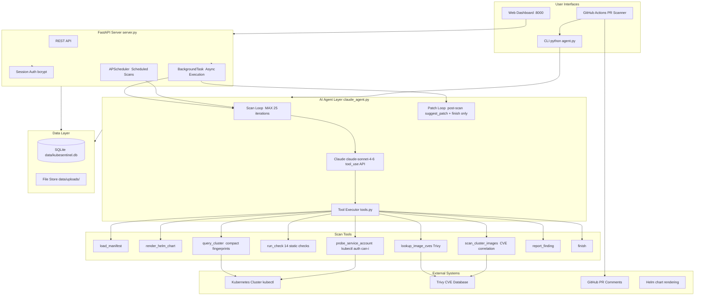

# KubeSentinel — AI-Powered Kubernetes Security Platform

> **Detect. Reason. Fix.** — The only Kubernetes security agent that reasons across CVE, misconfiguration, RBAC, and network signals, then generates AI-powered YAML remediation patches on demand.

[](LICENSE)
[](https://www.python.org/)
[](https://www.anthropic.com/)
[](tests/)

---

## What Makes KubeSentinel Different

Traditional Kubernetes security tools follow the same loop:

> **Ingest → Detect → Surface → Human decides → Human acts**

KubeSentinel closes that loop:

> **Observe → Reason → Patch → Explain → Human approves**

The agent doesn't just find that `runAsRoot: true` is misconfigured — it correlates that finding with CVE data, RBAC exposure, and network policy gaps to produce a compound risk score. Then, on demand, it generates corrected YAML patches for every finding with a one-sentence explanation. Static scanners report. KubeSentinel reasons and acts.

---

## Web Dashboard


An on-prem security dashboard — runs on your internal network, accessible by IP. No SaaS dependency, no data leaves your environment.

---

## Architecture



### Two-phase design: Scan → Patch

**Phase 1 — Scan loop** (`analyze_with_agent` / `analyze_cluster_with_agent`):
Claude drives the analysis iteratively. It calls tools in the order it decides based on what it finds — not a fixed pipeline. The scan loop never calls `suggest_patch`, so scan cost is predictable and efficient.

```
load_manifest / render_helm_chart
        ↓
run_check(ALL)                        ← 14 static checks across all resources
        ↓
lookup_image_cves                     ← Trivy CVE scan per unique image
        ↓
query_cluster                         ← compact security fingerprints via kubectl
        │                               (20x smaller than raw kubectl JSON)
        ↓
probe_service_account                 ← runtime SA permission proof via kubectl auth can-i
        ↓
scan_cluster_images                   ← CVE scan on running cluster images
        ↓
report_finding                        ← AI-identified issues + compound risk correlation
        ↓
finish
```

**Phase 2 — Patch loop** (post-scan, on demand — `generate_patches_for_findings`):
A minimal second loop runs only `suggest_patch` + `finish`. It receives the finding list from Phase 1 and generates corrected YAML patches. Triggered by `--patch` on the CLI or the "Generate AI Patches" button in the web UI. Works on both static and AI scans.

```
findings (from any scan — static or AI)
        ↓
suggest_patch × N                     ← minimal YAML snippet + one-sentence explanation
        ↓
finish                                ← patches stored in DB / returned to CLI
```

**Token efficiency:** `query_cluster` returns compact security fingerprints, not raw kubectl JSON. Typical reductions: secrets (272×), pods (20×), RBAC roles (2× with pre-parsed sensitive access lists). Target: under $0.10 per full cluster scan.

---

## Core Capabilities

| Capability | Detail |
|---|---|
| **AI patch generation** ✨ | Post-scan premium feature: `suggest_patch` generates corrected YAML for every finding. Works on static and AI scans. CLI: `--patch`. Web: "Generate AI Patches" button. |
| **Compound risk correlation** | Correlates CVE + misconfiguration + RBAC + network signals per pod into proven exploit chains (CMP-001 → CMP-004) |
| **Runtime SA probing** | `probe_service_account` uses `kubectl auth can-i --as` to confirm what each SA can actually access — no exec, no intrusion |
| **14 static checks** | CIS Benchmark, NSA/CISA Hardening Guide, OWASP K8s Top 10 |
| **Agentic reasoning** | Claude drives the scan iteratively — decides tool order and depth based on findings |
| **Token-efficient cluster analysis** | `query_cluster` returns compact security fingerprints — 20–272× smaller than raw kubectl JSON |
| **CVE scanning** | Trivy integration — top CVEs per severity, stored per scan, image CVE dashboard |
| **Helm support** | `helm template` rendering before analysis |
| **Web dashboard** | Multi-user, scan history, scheduling, image CVE view |
| **PR-level scanning** | GitHub Actions — comment on PRs, block merge on CRITICAL |
| **Suppression allowlist** | Acknowledge accepted risks with audit trail |
| **Offline / static mode** | Full static analysis with no API key required |
| **CI/CD friendly** | Exit code `2` on CRITICAL — drop into any pipeline |

---

## Quick Start

### Prerequisites

- Python 3.10+
- An [Anthropic API key](https://console.anthropic.com/) (required for AI mode; static mode works without one)
- Optional: `kubectl`, `helm`, `trivy`

### 1 — Clone and set up environment

```bash
git clone https://github.com/jaydenaung/kubesentinel.git
cd kubesentinel

python3 -m venv venv
source venv/bin/activate          # macOS/Linux
# venv\Scripts\activate           # Windows

python -m pip install -r requirements.txt
```

### 2 — Configure your API key

```bash
cp .env.example .env
# Edit .env and set:  ANTHROPIC_API_KEY=sk-ant-your-key-here
```

Or export directly:

```bash
export ANTHROPIC_API_KEY=sk-ant-your-key-here
```

### 3 — Run your first scan

```bash
# AI agent scan (requires API key)
python agent.py samples/vulnerable.yaml

# Static checks only — instant, no API key required
python agent.py samples/vulnerable.yaml --no-ai

# AI scan + generate corrected YAML patches for every finding (premium)
python agent.py samples/vulnerable.yaml --patch

# Static scan + patches (patch generation works on any scan type)
python agent.py samples/vulnerable.yaml --no-ai --patch

# Scan an entire directory
python agent.py k8s/

# Render and scan a Helm chart
python agent.py ./my-helm-chart/

# Output to Markdown report
python agent.py samples/vulnerable.yaml --output reports/result.md

# Raw JSON with patches (pipe to other tools)
python agent.py samples/vulnerable.yaml --patch --json
```

### 4 — Start the web dashboard

```bash
python server.py                    # http://0.0.0.0:8000
python server.py --port 8080        # custom port
python server.py --host 127.0.0.1  # local-only
```

On first visit, a setup wizard creates your admin account.

---

## Step-by-Step Testing Guide

This section walks through validating every layer of KubeSentinel — from unit tests to end-to-end AI scanning.

### Step 1 — Run the unit test suite

```bash
source venv/bin/activate
pytest tests/ -v
```

Expected output: **48 tests pass**, covering all 14 static checks and the suppression allowlist. No API key or cluster connection required.

```
tests/test_analyzer.py::test_privileged_container PASSED
tests/test_analyzer.py::test_host_pid PASSED
...
tests/test_suppressor.py::test_suppress_by_check_id PASSED
========================= 48 passed in 0.42s =========================
```

### Step 2 — Static scan (no API key)

```bash
python agent.py samples/vulnerable.yaml --no-ai
```

Expect 10+ findings across CRITICAL and HIGH severities on the intentionally misconfigured sample manifest.

### Step 3 — AI agent scan

```bash
export ANTHROPIC_API_KEY=sk-ant-your-key-here
python agent.py samples/vulnerable.yaml
```

Watch the agent tool calls in the terminal output:

```
      📂  load_manifest(path=samples/vulnerable.yaml)
      🔍  run_check(check=ALL  resource=-1)
      🛡  lookup_image_cves(nginx:latest)
      🌐  query_cluster(pods)
      🔑  probe_service_account(vulnerable-sa  default)
      ⚠  report_finding([CRITICAL] Privileged container with host namespaces ...)
      ✅  finish(Found 14 findings ...)
```

Note: `suggest_patch` does **not** appear here — patch generation is a separate post-scan step.

### Step 4 — Generate AI patches (premium)

```bash
# Add --patch to generate corrected YAML for every finding
python agent.py samples/vulnerable.yaml --patch

# Works on static scans too
python agent.py samples/vulnerable.yaml --no-ai --patch
```

The patch step runs after the scan and shows:

```
[patch] Generating AI patches for findings...
      🔧  suggest_patch([K8S-001] Deployment/vulnerable-api)
      🔧  suggest_patch([K8S-003] Deployment/vulnerable-api)
      ✅  finish(...)
        8 patch(es) generated
```

Verify patches in JSON output:

```bash
python agent.py samples/vulnerable.yaml --patch --json | python -m json.tool | grep -A5 "suggested_patch"
```

### Step 5 — Web dashboard end-to-end

```bash
python server.py
```

1. Open `http://localhost:8000` → complete the setup wizard (create admin account)
2. Navigate to **Manifests** → **Upload Manifest** → select `samples/vulnerable.yaml`
3. Choose **AI Agent** or **Static** scan mode → click **Upload & Scan**
4. Watch the status badge cycle: `queued → running → done`
5. Click into the scan → view findings, severity breakdown, compound risk sections
6. Click **✨ Generate AI Patches** (top right of scan detail) → patches appear inline per finding
7. Navigate to **Images** → confirm CVE counts appear (requires Trivy)

### Step 6 — Static-only web scan (no API key)

Repeat Step 5 with **Static** scan mode selected. Findings appear without an API key — useful for air-gapped environments.

### Step 7 — PR-level scanning (GitHub Actions)

Push a branch with changes to any `.yaml` file. The workflow at `.github/workflows/kubesentinel.yml` will:

1. Detect changed YAML files in the PR
2. Run AI + static analysis on those files only
3. Post a finding summary as a PR comment
4. Block merge if CRITICAL findings are detected

To test locally before pushing:

```bash
python agent.py --files samples/vulnerable.yaml --pr-comment
```

### Step 8 — Suppression allowlist

```bash
cp samples/.k8s-checker-ignore.yaml .
python agent.py samples/vulnerable.yaml --no-ai
```

Suppressed findings still appear in the report footer with their stated reason — providing an audit trail for compliance reviews.

---

## Web Dashboard Reference

| Page | What it does |
|---|---|
| Dashboard | Security posture overview — critical/high counts, recent scans, clear history (admin) |
| Manifests | Upload YAML → AI Agent or Static scan → findings with compound risk and SA probe sections |
| Clusters | Onboard via kubeconfig → scan on demand or on schedule |
| Images | Container images across all scans — CVE counts + top CVEs grouped by severity |
| Users | Admin: create accounts, activate/deactivate |
| Scan detail | Per-scan findings, attack scenarios, patch viewer. **"✨ Generate AI Patches"** button triggers post-scan patch generation for any completed scan. |

**Scan scheduling:** Set a recurring interval per cluster (6h / 12h / 24h / 48h / weekly). Runs via APScheduler — no cron, no external infrastructure.

**Data storage:** Everything in `data/` (SQLite + uploaded files). Gitignored. Kubeconfigs stored `chmod 600`.

---

## PR-Level Manifest Scanning (GitHub Actions)

Copy the workflow into your repo:

```bash
mkdir -p .github/workflows
curl -o .github/workflows/kubesentinel.yml \
  https://raw.githubusercontent.com/jaydenaung/kubesentinel/main/.github/workflows/kubesentinel.yml
```

Add `ANTHROPIC_API_KEY` as a GitHub Actions secret. On every PR touching `.yaml`/`.yml`, KubeSentinel will scan changed files, post findings as a PR comment, and fail the check on CRITICAL findings.

**PR comment format:**

```
🛡 KubeSentinel · ⛔ BLOCKED

⛔ 1 CRITICAL finding must be resolved before merging.

Scanned: deployment.yaml, rbac.yaml
Findings: 5 (3 static, 2 AI-identified)

| Severity  | Count |
|-----------|-------|
| 🔴 CRITICAL | 1   |
| 🟠 HIGH     | 2   |
| 🟡 MEDIUM   | 2   |
```

Without an API key, falls back to static checks only.

---

## Static Checks Reference

| Check ID | Category | Severity |
|---|---|---|
| K8S-001 | Privileged container | CRITICAL |
| K8S-002 | Host namespaces (PID / IPC / Network) | CRITICAL / HIGH |
| K8S-003 | Root user (UID 0 or runAsNonRoot: false) | HIGH / MEDIUM |
| K8S-004 | Dangerous capabilities (SYS_ADMIN, ALL, …) | CRITICAL / HIGH |
| K8S-005 | Writable root filesystem | MEDIUM |
| K8S-006 | Missing resource limits / requests | MEDIUM / LOW |
| K8S-007 | Unpinned image tag (`:latest` or no tag) | MEDIUM |
| K8S-008 | Service account token auto-mount | MEDIUM |
| K8S-009 | hostPath volumes | CRITICAL / HIGH |
| K8S-010 | Missing labels (NetworkPolicy targeting) | LOW |
| K8S-011 | Hardcoded secrets in env vars | HIGH |
| K8S-012 | Missing liveness / readiness probes | LOW |
| K8S-013 | Missing pod-level securityContext / seccomp | MEDIUM |
| K8S-014 | RBAC wildcard verbs or resources | CRITICAL / HIGH |

---

## Configuration Reference

| Method | Example |
|---|---|
| `.env` file | `ANTHROPIC_API_KEY=sk-ant-...` |
| Environment variable | `export ANTHROPIC_API_KEY=sk-ant-...` |
| Model override (CLI) | `--model claude-haiku-4-5-20251001` |
| Model override (env) | `K8S_CHECKER_MODEL=claude-haiku-4-5-20251001` |

Default model: `claude-sonnet-4-6`

Exit codes: `0` = clean, `1` = error, `2` = CRITICAL findings detected.

---

## Suppressing Accepted Risks

Create `.k8s-checker-ignore.yaml` to silence findings your team has reviewed. Suppressed findings appear in the report footer for auditability.

```yaml
suppress:
  - check_id: K8S-008
    resource: Deployment/legacy-api
    reason: "Migrating off auto-mounted SA tokens in Q3 2026 — JIRA-1234"

  - check_id: K8S-007
    reason: "Internal registry enforces immutable tags at push time"
```

---

## Roadmap

KubeSentinel is on a deliberate path from detection to autonomous remediation.

| Phase | Feature | Status |
|---|---|---|
| ✅ 1 | **AI patch generation** — post-scan premium feature; `--patch` CLI flag + "✨ Generate AI Patches" web button; works on static and AI scans | **Shipped** |
| ✅ 1b | **Runtime SA probing** — `probe_service_account` confirms exploitability via `kubectl auth can-i --as`; compound risk correlation (CVE + misconfiguration + RBAC + network) | **Shipped** |
| ✅ 1c | **Token-efficient fingerprinting** — `query_cluster` emits compact security fingerprints (20–272× smaller than raw kubectl JSON) | **Shipped** |
| 🔄 2 | **Patch review UI** — diff viewer with approve / reject workflow in the web dashboard | In progress |
| 📋 3 | **GitHub PR creation** — agent opens fix PRs against source repos after human approval | Planned |
| 📋 4 | **Compliance report generator** — map findings to CIS, NIST, SOC2 controls | Planned |
| 📋 5 | **Findings relationship graph** — model attack paths across CVE → image → deployment → RBAC | Planned |
| 📋 6 | **Runtime signals** — Falco / Kubernetes audit log integration | Planned |
| 📋 7 | **Multi-agent architecture** — triage, remediation, compliance, and orchestrator agents | Planned |

---

## Project Structure

```
kubesentinel/
├── agent.py              # CLI entry point — arg parsing, orchestration
├── analyzer.py           # YAML parser, 14 static checks, CHECK_REGISTRY
├── claude_agent.py       # Agentic loop using Anthropic tool_use API
├── tools.py              # Tool schemas + execution + security fingerprinting layer
├── reporter.py           # Markdown and PR comment renderer
├── suppressor.py         # Suppression allowlist loader and filter
├── server.py             # FastAPI server entry point
├── requirements.txt
├── .env.example
├── CONTRIBUTING.md
├── .github/
│   └── workflows/
│       └── kubesentinel.yml  # PR-level manifest scanning
├── web/
│   ├── database.py       # SQLAlchemy models — User, Manifest, Cluster, Scan, Finding, Image
│   ├── auth.py           # Session auth, bcrypt password hashing
│   ├── scanner.py        # Background scan execution (manifest + cluster)
│   ├── scheduler.py      # APScheduler — scheduled cluster scans
│   ├── routes/           # FastAPI routers (dashboard, manifests, clusters, images, users, api)
│   └── templates/        # Jinja2 templates — dark-theme dashboard UI
├── tests/
│   ├── test_analyzer.py  # 40 unit tests — all 14 static checks
│   └── test_suppressor.py # 8 unit tests — suppression logic
├── samples/
│   ├── vulnerable.yaml              # Intentionally misconfigured manifest
│   ├── secure.yaml                  # Hardened reference manifest
│   ├── test-sa-probe.yaml           # SA probe + compound risk test manifest
│   └── .k8s-checker-ignore.yaml    # Example suppression config
└── data/                 # Runtime data — DB, uploads, kubeconfigs (gitignored)
```

---

## Optional: Install External Tools

```bash
# CVE scanning
brew install trivy          # macOS
# https://aquasecurity.github.io/trivy/ for other platforms

# Helm chart rendering
brew install helm

# kubectl — via your cloud provider CLI or:
# https://kubernetes.io/docs/tasks/tools/
```

All three are optional. KubeSentinel gracefully skips any step for which the tool is not installed.

---

## CI/CD Integration (Generic)

```yaml
# GitHub Actions — full repo scan on push to main
- name: KubeSentinel security check
  run: |
    python -m pip install -r requirements.txt
    python agent.py k8s/ --output reports/security.md
  env:
    ANTHROPIC_API_KEY: ${{ secrets.ANTHROPIC_API_KEY }}
```

---

## Troubleshooting

**`ModuleNotFoundError`** — always use `python -m pip` inside an activated venv:

```bash
source venv/bin/activate
python -m pip install -r requirements.txt
which python   # should point inside venv/bin/
```

**`ANTHROPIC_API_KEY not set`**:

```bash
export ANTHROPIC_API_KEY=sk-ant-your-key-here
# or add to .env file in project root
```

**Port already in use**:

```bash
lsof -ti:8000 | xargs kill -9
python server.py
```

**Trivy / helm / kubectl not found** — these are optional; install only what you need. KubeSentinel logs a graceful skip and continues.

---

## Contributing

See [CONTRIBUTING.md](CONTRIBUTING.md) for how to add static checks, agent tools, and tests.

**Add a static check:** implement a function in `analyzer.py` taking `(resource, context)`, returning a finding dict or `None`, register in `CHECK_REGISTRY`, add tests.

**Add an agent tool:** define its JSON schema in `TOOLS` in `tools.py`, add an execution function, wire into `execute_tool`. To restrict a tool to the patch loop only (post-scan), omit it from the main scan by checking `build_tools(patch_enabled=False)`.

---

## Disclaimer

KubeSentinel is provided for **informational and educational purposes only**.

- **Read-only** — KubeSentinel never modifies your cluster, manifests, or any external system. It only reads and reports.
- **No security guarantee** — A clean report does not mean your cluster is secure. Always combine with manual review, penetration testing, and defence-in-depth.
- **AI findings require human review** — Findings and patches marked `[AI]` are generated by a large language model. They may contain false positives or errors. Never apply an AI-generated patch without independent verification.
- **No warranty** — Provided "as is", without warranty of any kind. The author accepts no liability for damages of any kind.
- **Untrusted input** — Do not run KubeSentinel against YAML from untrusted sources without reviewing it first. Malicious YAML could contain prompt injection attempts.

> **TL;DR:** This is a reasoning and reporting tool, not a compliance auditor. It surfaces issues and suggests fixes for your engineers to review — it does not replace human judgment or formal security assessments.

---

## License

Apache License 2.0 — see [LICENSE](LICENSE).

Copyright 2026 Jayden Aung
