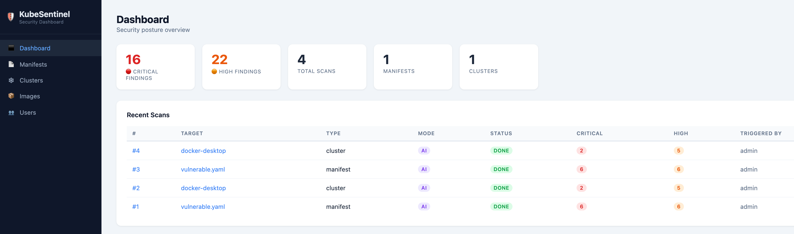
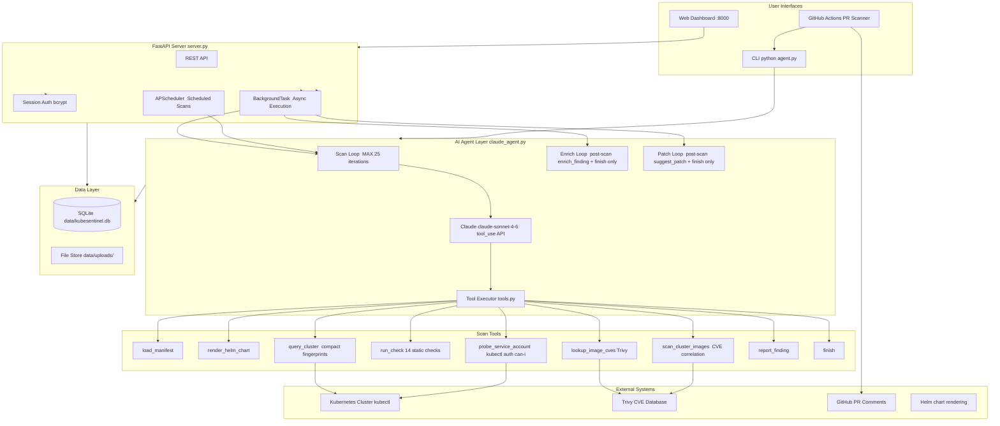

# KubeSentinel — AI-Powered Kubernetes Security Agent

> **Detect. Reason. Fix.** — An agentic Kubernetes security platform that reasons across CVE, misconfiguration, RBAC, and network signals to surface proven exploit chains, then enriches findings with AI-generated attack scenarios and YAML remediation patches on demand.

[](LICENSE)
[](https://www.python.org/)
[](https://www.anthropic.com/)
[](tests/)
[](https://hub.docker.com/r/jaydenaung17/kubesentinel)
[](https://hub.docker.com/r/jaydenaung17/kubesentinel)
[](https://ghcr.io/jaydenaung/kubesentinel)

---

## Latest Release — v1.0.0

> **KubeSentinel v1.0.0 is now available as a signed container image on Docker Hub and GHCR.**
> This is the first production release — fully containerized, multi-platform, and ready to deploy on any Kubernetes environment.

| | |
|---|---|
| **Docker Hub** | [`jaydenaung17/kubesentinel:v1.0.0`](https://hub.docker.com/r/jaydenaung17/kubesentinel) |
| **GHCR** | `ghcr.io/jaydenaung/kubesentinel:v1.0.0` |
| **Platforms** | `linux/amd64` · `linux/arm64` (Apple Silicon native) |
| **Image signing** | cosign keyless (sigstore) — verifiable supply chain |
| **Bundled tools** | kubectl · trivy · helm — no separate installation required |

```bash
docker pull jaydenaung17/kubesentinel:latest

# With AI features (enrichment, patch generation, agentic scanning)
docker run -p 8000:8000 -e ANTHROPIC_API_KEY=sk-ant-... -v kubesentinel-data:/app/data jaydenaung17/kubesentinel:latest

# Without API key — static scanning, CVE scanning, CIS compliance all still work
docker run -p 8000:8000 -v kubesentinel-data:/app/data jaydenaung17/kubesentinel:latest
```

**What's included in v1.0.0:** static manifest scanning (14 checks) · agentic cluster scanning · compound risk correlation · AI enrichment with attack scenarios · AI patch generation · CIS compliance scanning · token tracking · prompt caching · web dashboard · GitHub Actions PR scanner

---

## What Makes KubeSentinel Different

Most traditional Kubernetes security tools follow the same loop:

> **Ingest → Detect → Surface → Human decides → Human acts**

KubeSentinel closes that loop:

> **Observe → Reason → Correlate → Enrich → Patch → Human approves**

The agent doesn't just find that `runAsRoot: true` is misconfigured — it correlates that finding with CVE data, RBAC exposure, and network policy gaps to produce a compound risk score with a proven exploit chain. Then, on demand, it enriches every finding with an attack scenario and generates corrected YAML patches. Static scanners report. KubeSentinel reasons and acts.

---

## Web Dashboard



An on-prem security dashboard — runs on your internal network, accessible by IP. No SaaS dependency, no data leaves your environment.

---

## Architecture



### Three-phase design: Scan → Enrich → Patch

**Phase 1 — Scan**

Two distinct strategies depending on the source:

| Source | Strategy | Why |
|---|---|---|
| YAML / Helm manifests | Static analysis | Fast, deterministic, free — rules cover the structural layer |
| Live clusters | Agentic loop (`analyze_cluster_with_agent`) | Only an agent can explore running state, probe SA permissions, and correlate signals at runtime |

Static manifest scan flow:
```
load_manifest / render_helm_chart
        ↓
run_check(ALL)                        ← 14 static checks across all resources
        ↓
lookup_image_cves                     ← Trivy CVE scan per unique image
        ↓
findings persisted to DB              ← attack_scenario fields empty at this stage
```

Agentic cluster scan flow (Claude drives iteration order based on findings):
```
query_cluster                         ← compact security fingerprints via kubectl
        ↓
probe_service_account                 ← runtime SA permission proof via kubectl auth can-i
        ↓
scan_cluster_images                   ← CVE scan on running cluster images
        ↓
report_finding                        ← AI-identified issues + compound risk correlation
        ↓
finish
```

**Phase 2 — Enrich** (post-scan, on demand — `enrich_findings_with_ai`):

A focused second loop runs only `enrich_finding` + `finish`. It receives existing findings and adds a concrete `attack_scenario` to each (how an attacker exploits this specific misconfiguration). Skips findings that already have attack scenarios (sa-probe and compound findings are pre-enriched at scan time).

```
findings (from static manifest scan or cluster scan)
        ↓
enrich_finding × N                    ← 1-3 sentence exploit chain per finding
        ↓
finish                                ← attack scenarios stored in DB
```

**Phase 3 — Patch** (post-scan, on demand — `generate_patches_for_findings`):

A minimal third loop runs only `suggest_patch` + `finish`. Generates corrected YAML patches for every finding. Works on any scan.

```
findings (from any scan)
        ↓
suggest_patch × N                     ← minimal YAML snippet + one-sentence explanation
        ↓
finish                                ← patches stored in DB / returned to CLI
```

**Token efficiency:** All API calls use prompt caching (`cache_control: ephemeral`) — repeat input token cost reduced ~90% within a loop. `query_cluster` returns compact security fingerprints, not raw kubectl JSON (20–272× smaller). Target: under $0.10 per full cluster scan. Token usage and estimated cost are tracked per scan and displayed in the web UI.

---

## Core Capabilities

| Capability | Detail |
|---|---|
| **Agentic cluster scanning** | Claude drives the live cluster analysis iteratively — decides tool order and depth based on what it finds. Not a fixed pipeline. |
| **Static manifest scanning** | Instant, deterministic, no API key required. 14 checks covering CIS Benchmark, NSA/CISA Hardening Guide, OWASP K8s Top 10. |
| **AI enrichment** ✨ | Post-scan: adds concrete attack scenarios to findings. On-demand button in the web UI, works on both manifest and cluster scans. |
| **AI patch generation** ✨ | Post-scan: generates corrected YAML for every finding. CLI: `--patch`. Web: "✨ Generate AI Patches" button. |
| **Compound risk correlation** | Correlates CVE + misconfiguration + RBAC + network signals per pod into proven exploit chains (CMP-001 → CMP-004). |
| **Runtime SA probing** | `probe_service_account` uses `kubectl auth can-i --as` to confirm what each SA can actually access — no exec, no intrusion. |
| **CIS compliance scanning** | Maps cluster configuration against CIS Kubernetes Benchmark controls. Per-control PASS/FAIL/SKIP results with score and section grouping. |
| **Token tracking** | Input/output/cache tokens and estimated USD cost tracked per scan. Visible in the web UI per scan. |
| **Prompt caching** | All Claude API calls use `cache_control: ephemeral` — ~90% reduction in repeat input token costs within a scan loop. |
| **CVE scanning** | Trivy integration — top CVEs per severity, stored per scan, image CVE dashboard. |
| **Helm support** | `helm template` rendering before analysis. |
| **Web dashboard** | Multi-user, scan history, scheduling, image CVE view, compliance dashboard. |
| **PR-level scanning** | GitHub Actions — comment on PRs, block merge on CRITICAL. |
| **Suppression allowlist** | Acknowledge accepted risks with audit trail. |
| **Offline / static mode** | Full static analysis with no API key required. |
| **CI/CD friendly** | Exit code `2` on CRITICAL — drop into any pipeline. |

---

## Run with Docker

The fastest way to run KubeSentinel — no Python setup, no dependency installs. The image includes kubectl, trivy, and helm.

**No Anthropic API key? No problem.** Static manifest scanning, CVE scanning, and CIS compliance all work without one. AI enrichment and patch generation require the key.

```bash
# With AI features
docker run -p 8000:8000 \
  -e ANTHROPIC_API_KEY=sk-ant-... \
  -v kubesentinel-data:/app/data \
  jaydenaung17/kubesentinel:latest

# Without API key — static scanning still fully functional
docker run -p 8000:8000 \
  -v kubesentinel-data:/app/data \
  jaydenaung17/kubesentinel:latest
```

Open `http://localhost:8000`. On first visit, a setup wizard creates your admin account.

**Run on a different port:**
```bash
docker run -p 8001:8000 \
  -e ANTHROPIC_API_KEY=sk-ant-... \
  -v kubesentinel-data:/app/data \
  jaydenaung17/kubesentinel:latest
```

**Using docker-compose (recommended for local dev):**
```bash
# Clone the repo, then:
ANTHROPIC_API_KEY=sk-ant-... docker-compose up
```

### Scanning a live cluster from Docker

When running inside a container, the kubeconfig must use a hostname reachable from inside Docker — not `127.0.0.1`. For Docker Desktop:

```bash
# Create a container-compatible kubeconfig
kubectl config view --raw --minify --context=docker-desktop | \
  sed 's|https://127.0.0.1:6443|https://kubernetes.docker.internal:6443|g' \
  > ~/Desktop/kubeconfig-docker.yaml
```

Upload `kubeconfig-docker.yaml` in the Clusters UI. `kubernetes.docker.internal` is in Docker Desktop's API server TLS certificate SANs, so TLS verification works without skipping.

### Available image tags

| Tag | Description |
|---|---|
| `latest` | Latest stable release |
| `v1.0.0` | Pinned semantic version |
| `sha-<git-sha>` | Exact commit build |

Images are published to both registries on every tagged release:
- Docker Hub: `jaydenaung17/kubesentinel`
- GHCR: `ghcr.io/jaydenaung/kubesentinel`

All images are signed with cosign keyless signing (sigstore) for supply chain verification.

---

## Quick Start (Python / source)

### Prerequisites

- Python 3.10+
- An [Anthropic API key](https://console.anthropic.com/) (required for AI enrichment and patch generation; static scanning works without one)
- Optional: `kubectl`, `helm`, `trivy`

### 1 — Clone and set up environment

```bash
git clone https://github.com/jaydenaung/kubesentinel.git
cd kubesentinel

python3 -m venv venv
source venv/bin/activate          # macOS/Linux
# venv\Scripts\activate           # Windows

python -m pip install -r requirements.txt
```

### 2 — Configure your API key

```bash
cp .env.example .env
# Edit .env and set:  ANTHROPIC_API_KEY=sk-ant-your-key-here
```

Or export directly:

```bash
export ANTHROPIC_API_KEY=sk-ant-your-key-here
```

### 3 — Run your first scan

```bash
# Static scan — instant, no API key required
python agent.py samples/vulnerable.yaml --no-ai

# Static scan + AI patch generation for every finding
python agent.py samples/vulnerable.yaml --no-ai --patch

# Scan an entire directory
python agent.py k8s/

# Render and scan a Helm chart
python agent.py ./my-helm-chart/

# Output to Markdown report
python agent.py samples/vulnerable.yaml --output reports/result.md

# Raw JSON (pipe to other tools)
python agent.py samples/vulnerable.yaml --json
```

### 4 — Start the web dashboard

```bash
python server.py                    # http://0.0.0.0:8000
python server.py --port 8080        # custom port
python server.py --host 127.0.0.1  # local-only
```

On first visit, a setup wizard creates your admin account.

---

## Step-by-Step Testing Guide

### Step 1 — Run the unit test suite

```bash
source venv/bin/activate
pytest tests/ -v
```

Expected output: **48 tests pass**, covering all 14 static checks and the suppression allowlist. No API key or cluster connection required.

### Step 2 — Static manifest scan

```bash
python agent.py samples/vulnerable.yaml --no-ai
```

Expect 10+ findings across CRITICAL and HIGH severities.

### Step 3 — AI patch generation

```bash
export ANTHROPIC_API_KEY=sk-ant-your-key-here
python agent.py samples/vulnerable.yaml --no-ai --patch
```

Generates corrected YAML for every finding:

```
[patch] Generating AI patches for findings...
      🔧  suggest_patch([K8S-001] Deployment/vulnerable-api)
      🔧  suggest_patch([K8S-003] Deployment/vulnerable-api)
      ✅  finish(...)
        8 patch(es) generated
```

### Step 4 — Web dashboard end-to-end

```bash
python server.py
```

1. Open `http://localhost:8000` → complete the setup wizard
2. Navigate to **Manifests** → upload `samples/vulnerable.yaml` → click **Upload & Scan**
3. Watch the status badge cycle: `queued → running → done`
4. Click **🧠 Enrich with AI** (right panel) → attack scenarios appear per finding
5. Click **✨ Generate AI Patches** → patches appear inline per finding
6. View token usage and estimated cost in the **AI Enrichment** card

### Step 5 — Live cluster scan + enrichment

1. Navigate to **Clusters** → onboard a cluster with a kubeconfig
2. Click **Scan Now** — static checks run instantly
3. Click **🧠 Enrich with AI** — Claude adds attack scenarios to all static findings
4. Review compound risk findings (CVE + RBAC + network signals correlated automatically)

### Step 6 — CIS compliance scan

1. Navigate to **Compliance** → select a cluster → click **Run CIS Scan**
2. View per-control PASS/FAIL/SKIP results grouped by section with an overall score

### Step 7 — PR-level scanning (GitHub Actions)

Push a branch with changes to any `.yaml` file. The workflow at `.github/workflows/kubesentinel.yml` will scan changed files, post a finding summary as a PR comment, and block merge on CRITICAL findings.

### Step 8 — Suppression allowlist

```bash
cp samples/.k8s-checker-ignore.yaml .
python agent.py samples/vulnerable.yaml --no-ai
```

Suppressed findings still appear in the report footer for audit trail.

---

## Web Dashboard Reference

| Page | What it does |
|---|---|
| **Dashboard** | Security posture overview — critical/high counts, recent scans |
| **Manifests** | Upload YAML/Helm → instant static scan → AI enrichment + patch generation on demand |
| **Clusters** | Onboard via kubeconfig → static scan on demand or on schedule → AI enrichment on demand |
| **Compliance** | CIS Kubernetes Benchmark scans — per-control results, section grouping, overall score |
| **Images** | Container images across all scans — CVE counts + top CVEs by severity |
| **Users** | Admin: create accounts, activate/deactivate |

**AI Enrichment card** (manifest detail + cluster detail right panel):
- **🧠 Enrich with AI** — triggers post-scan enrichment for the latest scan
- Shows spinner while running, "AI enriched" badge when complete
- Displays token breakdown: input, output, cache hits, estimated cost in USD

**Scan scheduling:** Set a recurring interval per cluster (6h / 12h / 24h / 48h / weekly). Runs via APScheduler — no cron, no external infrastructure.

**Data storage:** Everything in `data/` (SQLite + uploaded files). Gitignored. Kubeconfigs stored `chmod 600`.

---

## Publishing the Container Image

### Manual push (first time or one-off release)

```bash
# Step 1 — Build for both platforms
docker buildx build \
  --platform linux/amd64,linux/arm64 \
  --tag jaydenaung17/kubesentinel:v1.0.0 \
  --tag jaydenaung17/kubesentinel:latest \
  --tag ghcr.io/jaydenaung/kubesentinel:v1.0.0 \
  --tag ghcr.io/jaydenaung/kubesentinel:latest \
  --push \
  .

# Step 2 — Log in to Docker Hub (if not already)
docker login -u jaydenaung17

# Step 3 — Log in to GHCR (use a GitHub personal access token with write:packages scope)
echo YOUR_GITHUB_TOKEN | docker login ghcr.io -u jaydenaung --password-stdin
```

### Automated push via GitHub Actions (recommended)

Every time you push a version tag, the publish workflow builds and pushes to both registries automatically:

```bash
git tag v1.0.0
git push --tags
```

Required GitHub secrets (Settings → Secrets → Actions):

| Secret | Value |
|---|---|
| `DOCKERHUB_USERNAME` | `jaydenaung17` |
| `DOCKERHUB_TOKEN` | Docker Hub access token (hub.docker.com → Account Settings → Security) |

`GITHUB_TOKEN` for GHCR is automatic — no setup needed.

---

## PR-Level Manifest Scanning (GitHub Actions)

Copy the workflow into your repo:

```bash
mkdir -p .github/workflows
curl -o .github/workflows/kubesentinel.yml \
  https://raw.githubusercontent.com/jaydenaung/kubesentinel/main/.github/workflows/kubesentinel.yml
```

Add `ANTHROPIC_API_KEY` as a GitHub Actions secret. On every PR touching `.yaml`/`.yml`, KubeSentinel scans changed files, posts findings as a PR comment, and fails the check on CRITICAL findings.

---

## Static Checks Reference

| Check ID | Category | Severity |
|---|---|---|
| K8S-001 | Privileged container | CRITICAL |
| K8S-002 | Host namespaces (PID / IPC / Network) | CRITICAL / HIGH |
| K8S-003 | Root user (UID 0 or runAsNonRoot: false) | HIGH / MEDIUM |
| K8S-004 | Dangerous capabilities (SYS_ADMIN, ALL, …) | CRITICAL / HIGH |
| K8S-005 | Writable root filesystem | MEDIUM |
| K8S-006 | Missing resource limits / requests | MEDIUM / LOW |
| K8S-007 | Unpinned image tag (`:latest` or no tag) | MEDIUM |
| K8S-008 | Service account token auto-mount | MEDIUM |
| K8S-009 | hostPath volumes | CRITICAL / HIGH |
| K8S-010 | Missing labels (NetworkPolicy targeting) | LOW |
| K8S-011 | Hardcoded secrets in env vars | HIGH |
| K8S-012 | Missing liveness / readiness probes | LOW |
| K8S-013 | Missing pod-level securityContext / seccomp | MEDIUM |
| K8S-014 | RBAC wildcard verbs or resources | CRITICAL / HIGH |

---

## Configuration Reference

| Method | Example |
|---|---|
| `.env` file | `ANTHROPIC_API_KEY=sk-ant-...` |
| Environment variable | `export ANTHROPIC_API_KEY=sk-ant-...` |
| Model override (CLI) | `--model claude-haiku-4-5-20251001` |
| Model override (env) | `K8S_CHECKER_MODEL=claude-haiku-4-5-20251001` |

Default model: `claude-sonnet-4-6`

Exit codes: `0` = clean, `1` = error, `2` = CRITICAL findings detected.

---

## Suppressing Accepted Risks

Create `.k8s-checker-ignore.yaml` to silence findings your team has reviewed:

```yaml
suppress:
  - check_id: K8S-008
    resource: Deployment/legacy-api
    reason: "Migrating off auto-mounted SA tokens in Q3 2026 — JIRA-1234"

  - check_id: K8S-007
    reason: "Internal registry enforces immutable tags at push time"
```

Suppressed findings appear in the report footer for auditability.

---

## Roadmap

| Phase | Feature | Status |
|---|---|---|
| ✅ 1 | **Static manifest scanning** — 14 checks, CIS/NSA/OWASP coverage, CLI + web | **Shipped** |
| ✅ 1b | **Agentic cluster scanning** — Claude-driven loop, SA probing, compound risk correlation | **Shipped** |
| ✅ 1c | **Token-efficient fingerprinting** — `query_cluster` emits compact security fingerprints (20–272× smaller than raw kubectl JSON) | **Shipped** |
| ✅ 1d | **AI patch generation** — post-scan, on demand; CLI `--patch` + web button | **Shipped** |
| ✅ 1e | **CIS compliance scanning** — per-control PASS/FAIL/SKIP with score and section grouping | **Shipped** |
| ✅ 1f | **AI enrichment** — post-scan attack scenario generation for manifest and cluster findings | **Shipped** |
| ✅ 1g | **Token tracking + prompt caching** — per-scan token usage, USD cost estimate, ~90% cache savings | **Shipped** |
| 🚀 v1.0.0 | **Container release** — signed multi-platform image on Docker Hub + GHCR, Dockerfile, docker-compose, automated publish pipeline | **Released** |
| 📋 2 | **Scan diff / posture trending** — new/resolved/unchanged findings between scans, posture score over time | Planned |
| 📋 3 | **Verification loop** — agent applies patch to manifest copy, re-scans, confirms finding resolved | Planned |
| 📋 4 | **Natural language security query** — ask questions across scan history in plain English | Planned |
| 📋 5 | **Multi-agent architecture** — triage, remediation, compliance, and orchestrator agents | Planned |
| 📋 6 | **Runtime signals** — Falco / Kubernetes audit log integration | Planned |

---

## Project Structure

```
kubesentinel/
├── agent.py              # CLI entry point — arg parsing, orchestration
├── analyzer.py           # YAML parser, 14 static checks, CHECK_REGISTRY
├── claude_agent.py       # Agentic loops: scan, enrich, patch (Anthropic tool_use API)
├── tools.py              # Tool schemas + execution + security fingerprinting layer
├── reporter.py           # Markdown and PR comment renderer
├── suppressor.py         # Suppression allowlist loader and filter
├── server.py             # FastAPI server entry point
├── requirements.txt
├── .env.example
├── CONTRIBUTING.md
├── cis/                  # CIS Benchmark control definitions
├── Dockerfile                # Container image — includes kubectl, trivy, helm
├── docker-compose.yml        # Local dev compose
├── .dockerignore
├── .github/
│   └── workflows/
│       ├── kubesentinel.yml  # PR-level manifest scanning
│       ├── security.yml      # Source code security scanning (CodeQL, Bandit, pip-audit, Trivy)
│       └── publish.yml       # Build + push to Docker Hub + GHCR on tag push
│   └── dependabot.yml        # Weekly dependency update PRs
├── web/
│   ├── database.py       # SQLAlchemy models — User, Manifest, Cluster, Scan, Finding, Image, ComplianceResult
│   ├── auth.py           # Session auth, bcrypt password hashing
│   ├── scanner.py        # Background scan execution + AI enrichment + patch generation
│   ├── cis_scanner.py    # CIS compliance scan execution
│   ├── scheduler.py      # APScheduler — scheduled cluster scans
│   ├── routes/           # FastAPI routers (dashboard, manifests, clusters, compliance, images, users, api)
│   └── templates/        # Jinja2 templates — dashboard UI
├── tests/
│   ├── test_analyzer.py       # 40 unit tests — all 14 static checks
│   ├── test_suppressor.py     # 8 unit tests — suppression logic
│   ├── test_cis_parsers.py    # CIS parser tests
│   ├── test_cis_runner.py     # CIS runner tests
│   └── test_cis_schema.py     # CIS schema tests
├── samples/
│   ├── vulnerable.yaml              # Intentionally misconfigured manifest
│   ├── secure.yaml                  # Hardened reference manifest
│   ├── test-sa-probe.yaml           # SA probe + compound risk test manifest
│   └── .k8s-checker-ignore.yaml    # Example suppression config
└── data/                 # Runtime data — DB, uploads, kubeconfigs (gitignored)
```

---

## Optional: Install External Tools

```bash
# CVE scanning
brew install trivy          # macOS
# https://aquasecurity.github.io/trivy/ for other platforms

# Helm chart rendering
brew install helm

# kubectl — via your cloud provider CLI or:
# https://kubernetes.io/docs/tasks/tools/
```

All three are optional. KubeSentinel gracefully skips any step for which the tool is not installed.

---

## CI/CD Integration (Generic)

```yaml
# GitHub Actions — full repo scan on push to main
- name: KubeSentinel security check
  run: |
    python -m pip install -r requirements.txt
    python agent.py k8s/ --output reports/security.md
  env:
    ANTHROPIC_API_KEY: ${{ secrets.ANTHROPIC_API_KEY }}
```

---

## Troubleshooting

**`ModuleNotFoundError`** — always use `python -m pip` inside an activated venv:

```bash
source venv/bin/activate
python -m pip install -r requirements.txt
which python   # should point inside venv/bin/
```

**`ANTHROPIC_API_KEY not set`** — AI enrichment and patch generation require the key; static scanning does not:

```bash
export ANTHROPIC_API_KEY=sk-ant-your-key-here
```

**Port already in use**:

```bash
lsof -ti:8000 | xargs kill -9
python server.py --port 8001
```

**Trivy / helm / kubectl not found** — optional; KubeSentinel logs a graceful skip and continues.

---

## Contributing

See [CONTRIBUTING.md](CONTRIBUTING.md) for how to add static checks, agent tools, and tests.

**Add a static check:** implement in `analyzer.py`, register in `CHECK_REGISTRY`, add tests.

**Add an agent tool:** define JSON schema in `tools.py`, add execution function, wire into `execute_tool`. Use `build_tools(patch_enabled=False)` to restrict a tool to the patch loop only.

---

## Disclaimer

KubeSentinel is provided for **informational and educational purposes only**.

- **Read-only** — KubeSentinel never modifies your cluster, manifests, or any external system.
- **No security guarantee** — A clean report does not mean your cluster is secure. Always combine with manual review, penetration testing, and defence-in-depth.
- **AI findings require human review** — Findings and patches marked `[AI]` are generated by a large language model and may contain false positives or errors. Never apply an AI-generated patch without independent verification.
- **No warranty** — Provided "as is", without warranty of any kind.
- **Untrusted input** — Do not run KubeSentinel against YAML from untrusted sources without reviewing it first.

> **TL;DR:** This is a reasoning and reporting tool, not a compliance auditor. It surfaces issues and suggests fixes for your engineers to review — it does not replace human judgment or formal security assessments.

---

## Credits

KubeSentinel is built on the shoulders of excellent open-source tools:

| Tool | Author | Use |
|---|---|---|
| [Trivy](https://github.com/aquasecurity/trivy) | Aqua Security | CVE scanning for container images and filesystem |
| [kubectl](https://github.com/kubernetes/kubectl) | The Kubernetes Authors | Live cluster interrogation and SA permission probing |
| [Helm](https://github.com/helm/helm) | The Helm Authors | Chart rendering before manifest analysis |
| [Claude API](https://www.anthropic.com/) | Anthropic | Agentic scanning, AI enrichment, patch generation |
| [FastAPI](https://github.com/tiangolo/fastapi) | Sebastián Ramírez | Web dashboard framework |
| [SQLAlchemy](https://github.com/sqlalchemy/sqlalchemy) | SQLAlchemy authors | Scan history and findings persistence |

Security checks are informed by the [CIS Kubernetes Benchmark](https://www.cisecurity.org/benchmark/kubernetes), [NSA/CISA Kubernetes Hardening Guidance](https://media.defense.gov/2022/Aug/29/2003066362/-1/-1/0/CTR_KUBERNETES_HARDENING_GUIDANCE_1.2_20220829.PDF), and [OWASP Kubernetes Top 10](https://owasp.org/www-project-kubernetes-top-ten/).

Full third-party attribution: [NOTICE](NOTICE)

---

## License

Apache License 2.0 — see [LICENSE](LICENSE).

Copyright 2026 Jayden Aung
